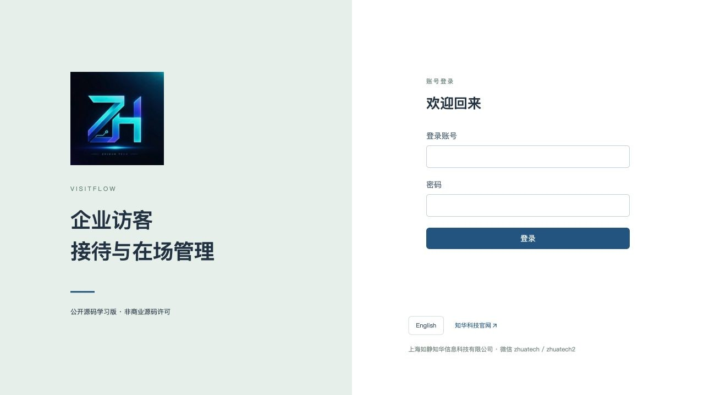
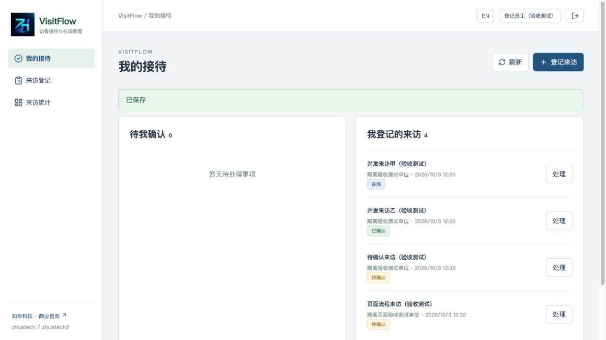
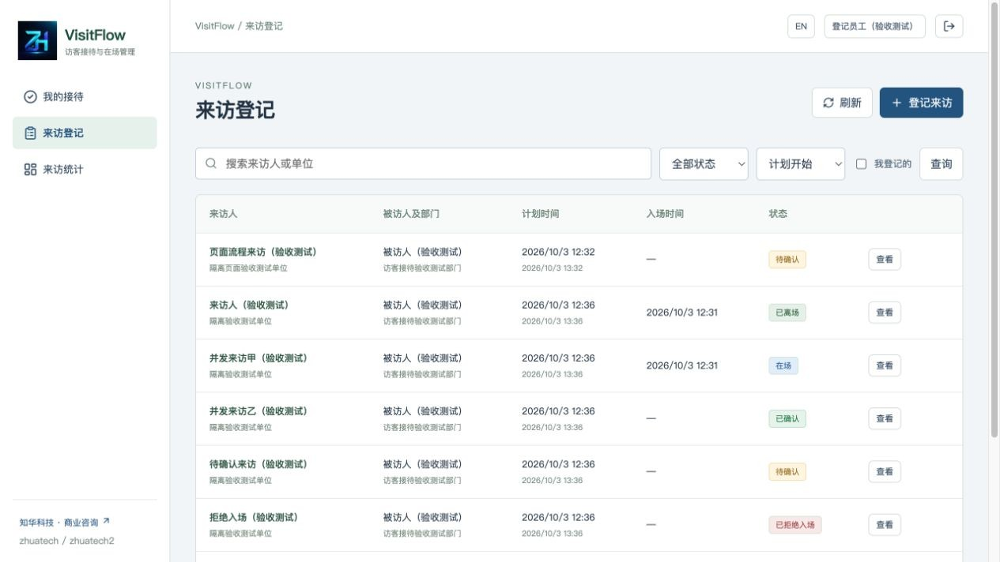
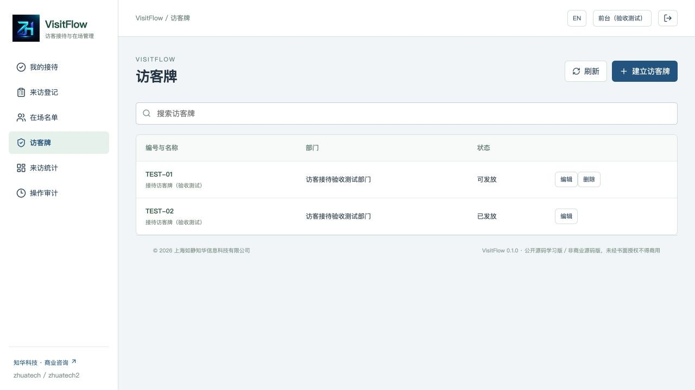
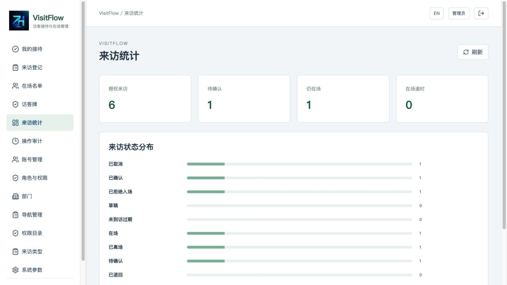
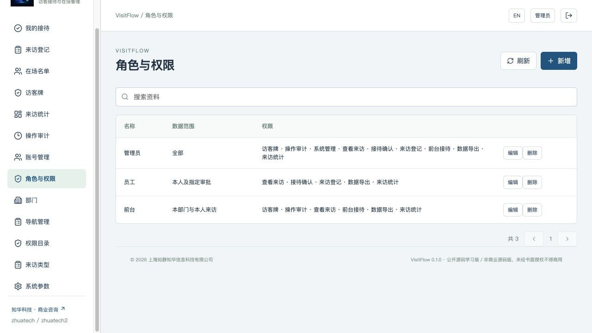
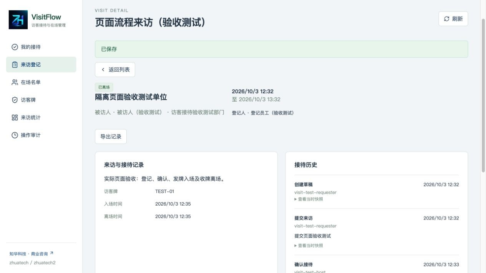
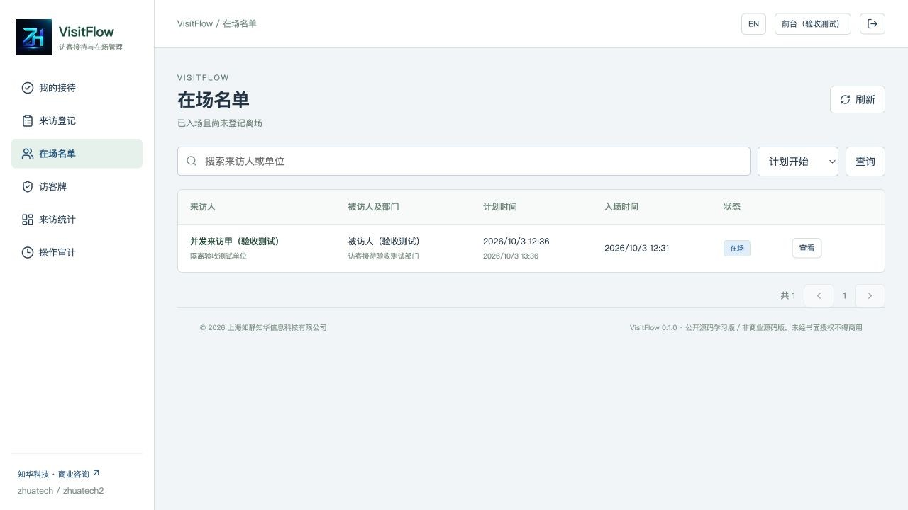

[中文](README.md) | [English](README.en.md)


# VisitFlow 企业访客接待与在场管理

**0.1.0 · 公开源码学习版／非商业源码版。未经书面授权不得商用。**

知华科技（上海如静知华信息科技有限公司） · [官网](https://www.zhuatech.cn/) · 商业授权、定制开发、部署与系统集成咨询微信：zhuatech / zhuatech2。

[接待手册](docs/operations.md) · [部署与升级](docs/deployment.md) · [接口](docs/api.md) · [架构与数据](docs/architecture.md) · [安全边界](docs/security.md)

## 谁将来访 谁仍在场

办公室、服务团队和厂区的来访通常经历员工登记、被访人确认、前台核对和访客牌交接。VisitFlow 将这条接待流程连接起来：员工看到本人登记的进度，被访人处理指定来访，前台核对批准状态后登记实际入场和离场。历史反映账号实际提交的操作，不把计划结束时间当成访客已经离场。

适合行政前台、接待员工、部门管理人员及企业软件学习者研究单场所访客接待。系统独立运行，不依赖库存、采购、费用、租赁或会议室系统；未连接门禁设备。

### 三个岗位

| 使用者 | 当前可操作内容 |
| --- | --- |
| 员工 | 创建、编辑本人草稿，选择独立被访人，提交或取消来访，处理本人被指定的确认，查询关联记录及导出 |
| 前台 | 查看本部门来访和在场名单，现场核对、发牌、登记入场、拒绝入场，收回牌后登记离场，维护部门访客牌 |
| 系统管理员 | 全范围来访和接待；管理账号、角色、权限目录、部门、导航、类型字典及系统参数 |

登记人与被访人不能是同一账号。管理员不能越过指定被访人的确认规则。前台实际入场和离场登记要求专门接待权限，员工不能自行签入。

## 从登记到牌归还

```text
草稿 → 提交 → 待确认 → 被访人确认 → 已确认 → 前台现场核对及发牌 → 在场 → 收牌并登记离场
              ↓退回           ↓撤销       ↓拒绝入场
            退回草稿         已取消       已拒绝入场
```

已提交记录保留历史，不能物理删除；仅从未送审的本人草稿可删除。待确认或已确认记录在计划结束时过期，定时检查周期一分钟。**在场记录不会自动离场**，超过计划结束仍展示逾时，访客牌仍处于已发放状态。

### 已实现模块

- 来访登记：姓名、单位、事由、类型、指定被访人和计划时间；搜索、状态筛选、本人筛选、数据库分页和确定排序。
- 独立接待确认：指定被访人确认、退回修改或撤销确认；来访资料在审批后冻结。
- 前台接待：人工核对来访人及接待确认，选择本部门启用且未发放的牌，拒绝入场、登记实际入场，确认收牌后登记离场。
- 访客牌：编号、名称、部门、启停、版本保护；同牌并发发放只有一人成功；在用牌不可停用，历史关联编号和部门冻结。
- 在场名单、我的接待、来访统计、在场逾时和已完成接待分钟；授权单据与事件快照 JSON 导出、不可修改的事件历史、操作审计。
- 用户、角色、部门、导航、权限目录、字典、参数管理；ALL／DEPARTMENT／ASSIGNED 数据范围，中文和英文界面。
- BCrypt 12、同源会话、CSRF、登录失败限制、账号停用及密码变化即时失效；业务行锁、版本号和请求幂等。

来访单次最长十二小时，可以跨午夜但不循环；日期时间按固定 Asia/Shanghai 展示，数据库存 UTC。默认登记窗口90天，可配置1–180天；临时来访的开始时间最多回溯30分钟。提前入场默认30分钟，可配置0–120分钟，提交时固化快照。结束时刻不再接受入场。

### 尚未实现

访客自助公网登记、二维码通行凭证、身份证及照片采集、人脸识别、身份认证服务、黑名单筛查、门禁开门、打印机集成、短信／邮件／企微通知、电子签名、重复来访自动合并、多人团体预约、牌丢失处置、多场所、SSO、多租户、AI和大规模容量认证。现场核对是前台的人工操作记录，不是电子身份验证。遗失访客牌时不能直接假称已经收回；需人工处理实际问题后完成本版本支持的登记。

没有演示模式或模拟外部服务，已实现核心功能无需第三方 API 账号。正式部署需要自行配置域名、HTTPS、备份和监控。

## 当前运行页面

登录页用于岗位认证；员工首页展示本人登记及指定确认，登记列表用于查找来访，前台牌管理维护可发放状态。详情展示现场进出及事件历史，在场名单保留实际未离场记录；统计和角色页面显示授权数据及权限。

截图来自隔离测试数据库中的实际操作，带“验收测试”的记录不随空库安装。

| 登录 | 员工首页 |
| --- | --- |
|  |  |

| 来访登记 | 前台访客牌管理 |
| --- | --- |
|  |  |

| 来访统计 | 角色与权限 |
| --- | --- |
|  |  |

| 来访详情与事件 | 实际在场名单 |
| --- | --- |
|  |  |

## 运行工程

Vue 通过 Nginx 同源访问 Spring Boot API，业务保存到 MySQL。Flyway 负责结构迁移，JPA 校验结构。后端、前端运行身份为非 root，数据库卷保存数据；默认只映射本机页面端口。

| 层 | 版本 |
| --- | --- |
| 后端 | Java21、Maven3.9、Spring Boot4.0.7、Spring Security、JPA、Flyway |
| 前端 | Vue3.5.40、Vite8.1.5、Node24.19.0、Lucide1.48.0 |
| 数据 | MySQL8.4、MariaDB JDBC3.5.10，UTC时间 |
| 检查 | Spotless2.43.0、ESLint10.11.0、Prettier3.9.9、JUnit、MockMvc、Node test |
| 部署 | Docker Compose v2、Nginx1.29，同源会话与健康依赖 |

```text
backend/src/main/java/cn/zhuatech/visitflow/  来访、权限、接待与后台
backend/src/main/resources/db/migration/    V1身份、V2来访和牌
backend/src/test/                           接口和时间规则测试
frontend/src/                              双语真实业务页面
frontend/public/brand/                     正式LOGO
scripts/                                   环境初始化、真实数据库验收、发布检查
docs/                                      操作、部署、接口、架构、安全及截图
compose.yaml                               MySQL、后端、前端与持久卷
```

业务表为 visitor_visit、visitor_badge、visit_event、visit_command。其余身份表存账号、角色、权限、部门、导航、参数、类型及操作审计，外键保护历史。列表每页最多100条，页面每页20条；主数据最多一万条，统计超过一万条明确拒绝，单实例、单场所部署。

空库只初始化总部、管理员／员工／前台角色、权限、13项导航、3类来访类型及参数。**不生成访客或访客牌**。管理员为 `admin`，密码来自私有环境配置，无公开固定密码；已有数据库重启不重置密码。

## 安装与启动

需要 Docker Engine／Docker Desktop、Compose v2、Python3、可访问官方依赖仓库的网络及空闲本地端口。源码开发另需 Java21、Maven3.9、Node24.19.0。

```sh
git clone https://github.com/zhuatech-han/zhuatech-visitflow.git
cd zhuatech-visitflow
python3 scripts/init-env.py
docker compose -p visitflow config --quiet
docker compose -p visitflow up -d --build --wait
```

访问 [http://127.0.0.1:8103/](http://127.0.0.1:8103/)，后端健康为 [http://127.0.0.1:8103/actuator/health](http://127.0.0.1:8103/actuator/health)。只在本机查看 `.env` 中的初始管理员密码。脚本生成三项独立强密码，以0600权限保存，不打印密码且不覆盖已有文件。先建立员工和前台，再创建访客牌。停止并保留数据：`docker compose -p visitflow down`；仅专用可丢弃测试库才使用 `down -v`。

| `.env.example` 配置 | 用途 |
| --- | --- |
| DATABASE_PASSWORD | 应用数据库密码，必填 |
| MYSQL_ROOT_PASSWORD | 数据库维护密码，必填 |
| ADMIN_PASSWORD | 空库初始管理员密码，12位以上含大写、小写和数字，UTF-8不超过72字节 |
| WEB_PORT | 页面端口8103，被占用时调整 |
| BIND_ADDRESS | 默认127.0.0.1 |
| COOKIE_SECURE | 本机HTTP为false，正式HTTPS为true |

源码开发使用独立MySQL8.4，配置 DATABASE_URL、DATABASE_USER、DATABASE_PASSWORD、DATABASE_CATALOG、ADMIN_PASSWORD；DATABASE_CATALOG与连接库名一致。后端在backend目录执行 `mvn spotless:check test spring-boot:run`；前端在frontend目录执行 `npm ci`、`npm run dev`。开发页面为 [http://127.0.0.1:5173](http://127.0.0.1:5173)，Vite代理到本机8080。不要使用生产数据库做验收。

## 数据升级与恢复

迁移位于 `backend/src/main/resources/db/migration/`，V1__identity.sql 后执行 V2__visitors.sql，启动自动执行，JPA使用validate。升级前停止写入，备份数据库与私有环境配置；新增递增迁移，不修改已执行脚本。启动后核对迁移、健康、登录和完整接待。失败时恢复备份及旧版镜像，不用flyway repair掩盖结构不一致。步骤见[部署手册](docs/deployment.md)。

## 验证接待流程

```sh
cd backend
mvn spotless:check clean package
cd ../frontend
npm ci
npm run format:check
npm run lint
npm test
npm run build
cd ..
docker compose -p visitflow-check config --quiet
docker compose -p visitflow-check build
docker compose -p visitflow-check up -d --wait
# 只用于独立、全新、可丢弃数据库；会建立验收账号和业务记录
python3 scripts/smoke.py --run
docker compose -p visitflow-check restart mysql
docker compose -p visitflow-check up -d --wait mysql
docker compose -p visitflow-check restart backend frontend
docker compose -p visitflow-check up -d --wait
python3 scripts/smoke.py --verify
python3 scripts/release-check.py
```

后端覆盖接待状态、被访人独立性、权限、过期、真实在场、归牌、时间边界、幂等及同牌并发，集成测试使用H2 MySQL模式。验收脚本另在真实MySQL上验证同牌单一赢家、完整流程、隐私和重启持久化。最终数量见[版本说明](docs/releases.md)。

| 现象 | 处理 |
| --- | --- |
| 空库启动失败 | 检查必填密码、强度、数据库健康和迁移日志 |
| 8103被占用 | 在私有.env更改WEB_PORT后启动；不要停止其他项目 |
| 没有被访人 | 建立另一个启用、具备查看和接待确认权限的员工 |
| 无可发访客牌 | 建立本部门启用牌，检查实际归牌与在场记录 |
| 入场被拒绝 | 确认被访人已确认、来访时间窗口及现场核对勾选 |
| 离场被拒绝 | 先收回牌、勾选收回并填写处理意见 |
| 版本已改变 | 刷新详情后重开操作，不改内容后沿用旧请求键 |
| 计划结束仍在场 | 完成实际离场交接；系统不会推断人员已离开 |
| .env修改但密码不变 | 初始化密码只作用于空库，已有账号由授权管理员重置 |

## 安全 贡献与授权

会话30分钟、HttpOnly和SameSite=Strict Cookie、CSRF、BCrypt12、登录限速及接口数据范围已实现。只收集接待所需姓名、单位和事由，不收集身份证、照片或电话。访客资料和导出仍属于需要访问控制的业务数据，见[安全边界](docs/security.md)。对外部署需要HTTPS、验证数据库证书、备份、访问限制、审计保留和监控。测试不是压力或安全认证。

欢迎提交有业务原因、复现步骤和测试的改进；不要提交真实访客、客户资料、密码或环境文件。问题通过 [GitHub Issues](https://github.com/zhuatech-han/zhuatech-visitflow/issues) 反馈。漏洞不在公开Issue披露，可添加咨询微信说明“安全漏洞反馈”，通过后续私密渠道提供详情。

自有代码采用 [ZhuaTech Non-Commercial Source License 1.0](LICENSE)，为学习和非商业交流公开源码，非OSI开源许可证。未经书面授权不得收费部署、SaaS运营、转售或商业交付。[Vue](docs/licenses/vue.txt)、[Lucide](docs/licenses/lucide.txt)等第三方版权与许可保留，品牌署名不改变许可范围。

免责声明：部署方须自行评估安全、容量、数据保护和业务适配，本学习版不保证全部组织适用，不提供身份认证、门禁控制或生产合规保证。

## 联系知华科技

商业授权或深度定制开发请联系知华科技。

本项目由知华科技（上海如静知华信息科技有限公司）提供公开源码学习版本，主要用于个人学习、技术研究与非商业交流。未经书面授权不得商用。企业信息化建设、中小企业数字化转型、中小企业 AI 转型、私有化部署、软件外包、软件项目外包、软件实施、FDE 外包、OPC 技术支持及深度定制开发，请访问知华科技官网 [https://www.zhuatech.cn/](https://www.zhuatech.cn/)，或添加微信 zhuatech、zhuatech2 咨询。

| 商业授权／部署与系统集成 | 商业授权／定制开发 |
| --- | --- |
| 微信 **zhuatech** | 微信 **zhuatech2** |
|  |  |
